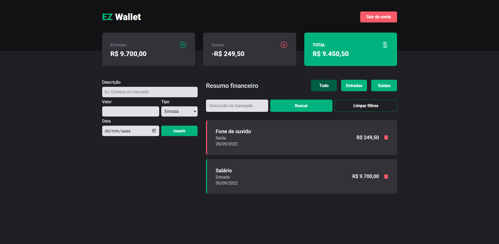
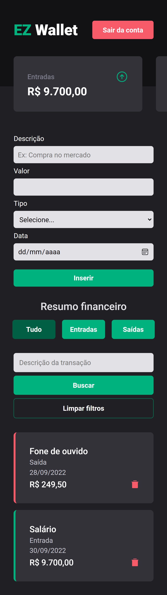
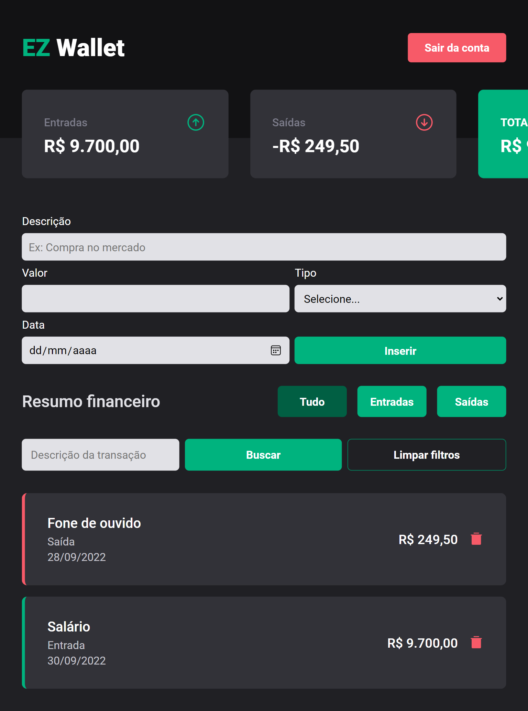

<h1 align="center">EZ Wallet</h1><br>



## 🚀 Introdução

Gerenciador de finanças pessoais desenvolvido com **React.js**, **Node.js**, **Express** e **MongoDB** - [Link do repositório do Back-end](https://github.com/luccarauedys/ez-wallet-back) - criado com base em conhecimentos adquiridos no Ignite da [Rocketseat](https://www.rocketseat.com.br/) e ao longo da formação na [Driven Education](https://www.driven.com.br/sobre-nos).

## 📋 Pré-requisitos

- [Node.js 10+](https://nodejs.org/en/download/)

## Uso

Para utilizar o **EZ Wallet**, você pode acessar [este link](https://ez-wallet-plum.vercel.app/) ou clonar o Projeto em sua máquina:

```
git clone https://github.com/luccarauedys/ez-wallet-front.git
```

Após clonar, entre na pasta e instale as dependências:

```
npm install
```

Por fim, rode a aplicação:

```
npm start
```

**Observação**: Lembre-se de setar as variáveis de ambiente de acordo o arquivo **.env.example**.

## Tecnologias utilizadas

- [React JS](https://reactjs.org/)
- [React Router DOM](https://reactrouter.com/en/main)
- [Context API](https://reactjs.org/docs/context.html)
- [Axios](https://axios-http.com/docs/intro)
- [Styled-components](https://styled-components.com/)
- [React Hook Form](https://react-hook-form.com/get-started)
- [React Loader Spinner](https://mhnpd.github.io/react-loader-spinner/docs/intro)
- [React Toastify](https://fkhadra.github.io/react-toastify/introduction/)
- [Phosphor Icons](https://phosphoricons.com/)

## Screenshots

<div style="display: flex; gap: 2rem">
  
  
</div>

---

Feito com :heart: por [Lucca Rauédys](https://github.com/luccarauedys).
